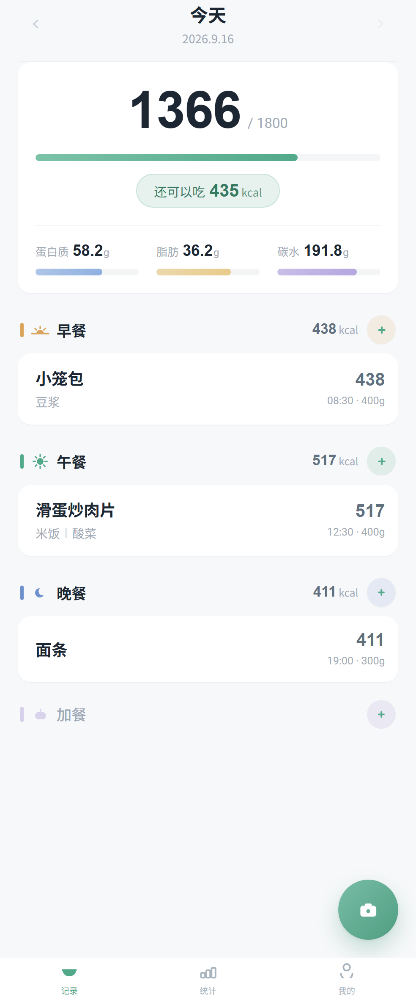
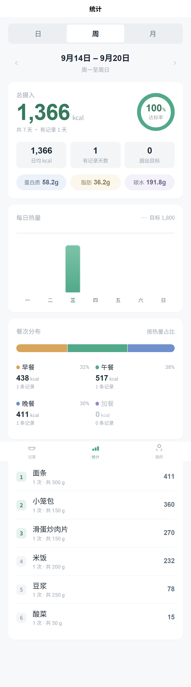
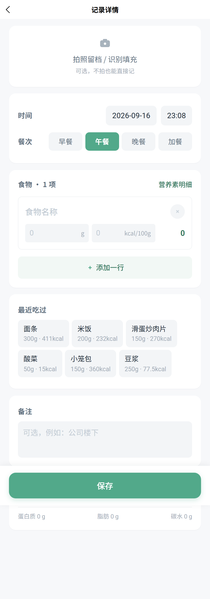
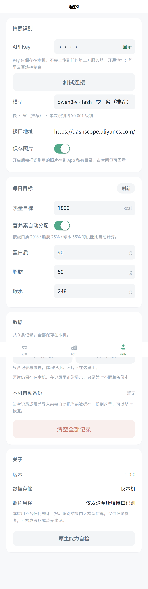
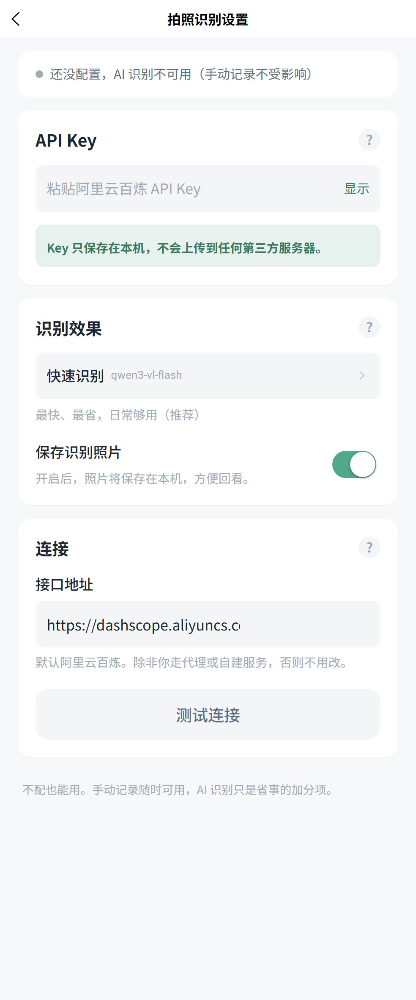

# 卡路里记录

拍一张饭菜照片，由视觉大模型估算热量与三大营养素，记在本机。
安卓 App，基于 uni-app（Vue 3 + Vite）。

<p align="center">
  
  
  
  
</p>

## 特性

- **拍照识别** —— 拍一张照片，由阿里云百炼 `qwen-vl` 估算热量与三大营养素；
  支持拆解混合菜品（盖浇饭拆成米饭 + 菜），也能直接读取包装上的营养成分表
- **结果可修正** —— 识别结果先落到确认页，逐项可改克数与热量再入库
- **手动兜底** —— 无网、没配 Key、识别失败时都能完整手动记录；
  手动路径同样可以拍照留档或事后识别填充
- **本地持久化** —— 记录存本机，照片存 App 私有目录，无任何统计上报
- **时间分类** —— 按日期分组 + 按时间自动归类餐次（早/午/晚/加餐，含夜宵）
- **汇总统计** —— 日 / 周 / 月视图、达标率、餐次分布、食物热量排行；
  另有**打卡热力图**（最近 13 周，五档深浅），点格子看那天的明细
- **设置不堆一起** —— 「我的」只放每日目标与两个入口（拍照识别设置 / 数据管理），
  技术配置收进二级页面，普通用户不会被 API Key 这类东西挡住
- **备份与后悔药** —— 清空记录或覆盖导入前会自动在本机留一份快照（保留最近 3 份，可一键回滚）；
  （照片导出暂时下掉了，原因与后续计划见「待优化」）

## 下载

直接装 APK（Android 10+，15 MB）：

**[⬇ 下载 v1.0.1](https://github.com/WHYOYCY/calorie-counting/releases/latest)** ·
[全部版本](https://github.com/WHYOYCY/calorie-counting/releases)

与上一版使用同一签名，可直接覆盖升级。

## 快速开始

```bash
npm install

npm run dev:h5     # 浏览器里开发调试（最快）
npm run dev:app    # 用 HBuilderX 内置基座在真机运行
npm run build:h5   # 构建 H5
npm run build:app  # 构建 App 资源，产物在 dist/build/app，用 HBuilderX 打包
```

打包 APK 需要 [HBuilderX](https://www.dcloud.io/hbuilderx.html)（云打包）。

## 配置 API Key

<p align="center">
  
</p>


App 内 **我的 → 拍照识别 → API Key** 填写阿里云百炼的 API Key，保存在本机。

> Key 不写进代码、不进版本库。获取地址：阿里云百炼控制台。
> 模型默认 `qwen3-vl-flash`（快且便宜，单次识别约 ¥0.001 量级），可在设置里切换。
> 填完可以点「测试连接」立刻验证，不用等到拍照才发现 Key 填错了。

## 不花额度联调

本地 mock 服务会返回一份固定的识别结果，没有 API Key 也能把
「拍照 → 识别 → 确认 → 入库」整条链路走通：

```bash
node scripts/mock-dashscope.mjs 5555
# 然后在 App「我的 → 接口地址」填 http://localhost:5555/v1
# Key 随便填一段够长的字符串即可（mock 只检查是否存在，不校验真伪）
```

> 真机访问不了 `localhost`，请换成电脑的局域网 IP，例如
> `http://192.168.1.5:5555/v1`，并确保手机与电脑在同一 Wi-Fi。

## 测试

```bash
npm test          # 静态检查 + 核心逻辑单元测试
npm run check     # 只跑静态检查（模板绑定 + Native.js 类导入）
npm run test:core # 只跑核心逻辑单元测试
```

`npm run check` 是两道静态检查，`npm test` 在其之上再跑单元测试。

1. **模板绑定检查**（`scripts/check-templates.mjs`）—— 把模板里引用到的标识符与
   `<script setup>` 里声明的名字做差集。这类错误单元测试完全抓不到
   （逻辑层本身是对的），只在渲染时才炸 `Property "x" was accessed during render`。
   顺带还查一件事：`<image>` 的 `:src` 若引用了 `photo` 却既不调
   `photoSrc(...)` 也不是 `*View` computed，直接报错 —— 存储路径不能裸绑给图片。

2. **Native.js 类导入检查**（`scripts/check-native.mjs`）——
   `plus.android.importClass()` **不会在当前作用域创建同名绑定**，
   不接收返回值就等于没导入，真机会报「Xxx is not defined」。
   这类错误单元测试永远抓不到：测试里的假 plus 是手写的，类永远存在。

3. **核心逻辑单元测试**（378 项断言）—— 日期与餐次归类、营养换算、
   数据层增删改查与迁移、统计聚合、DashScope 请求契约。

核心逻辑（`src/core/`）不依赖 uni 运行时，靠运行时特性探测解耦，
因此可以直接在 Node 里测，不需要模拟器。

### H5 冒烟测试

```bash
npm run build:h5
node scripts/seed-smoke.mjs      # 生成 3 个灌了种子数据、直达目标页的种子页
node scripts/serve-dist.mjs 4173 # 起静态服务
# 浏览器打开 http://localhost:4173/seed.html
```

## 目录结构

```
src/
├── core/                  # 纯逻辑，零 UI 依赖，全部可单测
│   ├── constants.js       # 常量、默认设置、餐次定义
│   ├── date.js            # 日期键、周/月边界、日期标签、餐次自动归类
│   ├── nutrition.js       # per100g 基准模型、营养换算、主菜识别、目标推导
│   ├── storage.js         # 本地存储原语（db 与 backup 共用，避免循环依赖）
│   ├── db.js              # 记录 CRUD、设置、schema 迁移、备份导入导出
│   ├── stats.js           # 逐日序列、区间汇总、食物聚合
│   ├── ai.js              # DashScope 客户端（JSON 容错解析 + 错误映射）
│   ├── photo.js           # 选图 / base64 / 落盘 / 删除（平台差异收敛处）
│   ├── draft.js           # 识别结果 → 编辑页 的内存中转
│   ├── base64.js          # base64 编解码
│   ├── utf8.js            # UTF-8 编解码（字符数 ≠ 字节数）
│   ├── color.js           # 从数据色算胶囊配色（半透明底 / 压暗文字）
│   ├── plusio.js          # plus.io 原语（唯一的写路径 + 大小核对）
│   ├── backup.js          # 本机快照、剪贴板、备份落盘
│   ├── selftest.js        # 原生能力自检（真机上哪条路能用）
│   └── native-fs.js       # 环境探测 + Native.js 工具（应用已不依赖其写入）
├── pages/
│   ├── index/index.vue        # 记录：今日汇总 + 餐次列表 + 悬浮操作
│   ├── stats/stats.vue        # 统计：日/周/月 + 图表 + 排行
│   ├── settings/settings.vue  # 我的：概览、每日目标、两个入口
│   ├── settings/ai.vue        # 拍照识别设置（API Key / 模型 / 接口地址）
│   ├── settings/data.vue      # 数据管理（备份恢复 / 快照 / 清空 / 自检）
│   └── record/edit.vue        # 记录详情：新增/编辑/删除、照片
├── static/                # 图标（由脚本生成，勿手改）
├── App.vue                # 全局样式
├── pages.json             # 路由 + tabBar
└── uni.scss               # 设计令牌（自动注入所有 scss 块）

scripts/
├── gen-icons.mjs          # 零依赖 PNG 生成器（4x 超采样抗锯齿）
├── test-core.mjs          # 单元测试 + 请求契约测试
├── check-templates.mjs    # 模板绑定静态检查
├── check-native.mjs       # Native.js 类导入静态检查
├── seed-smoke.mjs         # 冒烟测试种子页生成器
├── serve-dist.mjs         # 静态服务器
├── measure.mjs            # 注入探针测量 rem 缩放，排查布局问题
└── mock-dashscope.mjs     # 本地 mock 识别服务
```

## 设计说明

### 数据模型

一条记录里的每个食物项存**每 100g 基准值** `per100` + 实际克数 `grams`，
所有展示值由 `per100 × grams/100` 派生：

```js
{
  id, ts, date,            // date 与 meal 由 ts 派生，改时间会自动重算
  meal: 'breakfast' | 'lunch' | 'dinner' | 'snack',
  items: [{ name, grams, per100: { kcal, protein, fat, carbs } }],
  photo, note, source: 'ai' | 'manual', createdAt, updatedAt
}
```

这样改克数时营养自动联动，且不会出现「改了热量但营养素对不上」的自相矛盾。

### 列表标题选主菜而不是第一项

用户常常顺手先录米饭，拿米饭当标题会让人误以为这顿只吃了米饭。
`mainItem()` 按**单项热量最高**挑主角（热量相同取克数大的），其余菜品降为次级信息。

### 换手机时怎么办

现在**备份里只有记录与设置**（一个 JSON 文件）。照片存在本机、
在记录详情里正常显示，但暂时不跟着备份走 —— 换手机时照片不会过去。

这条链路为什么先撤下来、之后怎么重做，都写在「待优化 · 照片导出」里。
核心判断标准只有一条：**任何时候「记录不丢」都不能被照片的问题牵连。**

过去那条老路留下的教训还留在文档里（见下面的坑与修法表），
它们是重新做照片导出时必须避开的雷：

旧方案把 `backup.json` + `photos/` 打成一个 zip。导出时会把记录里的
照片路径改写成 zip 内的相对路径（这样才算可移植）；恢复时再把照片写回
新手机的私有目录并改回绝对路径。

几个关键取舍：

- **用 store（不压缩）方式打 zip**。照片是 JPEG，本来就已经压过，deflate
  收益约 0~3%；不压缩则读取端只需支持 store，**不必在 JS 里实现 inflate**。
  这也不依赖 plus.zip（那要在 manifest 里勾 Zip 模块）。
- **写入是流式的**，一次只在内存里拿一张照片，不是把几百 MB 全堆起来。
  但仍设了 120MB 上限：超过就明确拒绝并告诉用户去清理照片，而不是走到崩溃。
- **备份里没带的照片，导入时会把记录的图片字段清空**。留一个永远显示不
  出来的路径比没有更糟 —— 界面上一片空白还不告诉你为什么。
- 编辑页对读不出来的照片会明确显示「照片已丢失」，而不是默默留白。

### Native.js 的坑（真机踩出来的）

这个项目的备份链路要在 App 的**逻辑层 JS 引擎**里调原生 API。
uni-app 的 App 端不是浏览器环境（没有 `document` / `window` / `Blob`），
而且 Native.js 有不少操作是**不报错但什么都不做**的。
下面每一条都是真机报错后查出来或试出来的，列在这里免得重踩：

| 现象 | 原因 | 现在的做法 |
| --- | --- | --- |
| `当前内核不支持 Blob` | App 逻辑层无 `document`/`window`/`Blob` | 不用 Blob |
| 写入不报错，文件却是 0 字节 | **Native.js 的写入在这台设备上全部失效**：`RandomAccessFile.writeBytes`、`Files.writeString`、`Files.copy(Path,Path)`、MediaStore 输出流全都是"写了 N 字节，实际 0 字节" | 写入只用 plus.io 的 `FileWriter.write(String)` |
| `Xxx is not defined` | `importClass()` 不创建同名绑定 | 一律 `const X = importClass(...)`，`check-native.mjs` 兜底 |
| `resolver.insert is not a function` | Java 返回的实例方法不挂在 JS 代理上 | 走 `plus.android.invoke` |
| 照片存了却显示"已丢失" | plus.io 的 `entry.copyTo` **静默失败**（跨文件系统不报错、目标文件不存在），照片从来没落盘 | 照片存成 **base64 文本**（`.b64`），只用"写文本"这一条路 |
| 读文本读出来是双重编码 | 用 `readAsDataURL` 读一个内容本身就是 base64 的文本文件，会把内容**再** base64 一次 | 读文本用 `readAsText`，只有读二进制才用 `readAsDataURL` |
| 写入大小核对永远失败 | 拿字符串 `length`（字符数）去比文件大小（字节数），备份 JSON 里有中文必然对不上 | 用 `utf8Length()` |
| 写完了不知道成没成 | 静默失败没有任何信号 | **每次写入都回查字节数**，对不上就报失败 |
| `write 异常：[object Object]` | plus.io 的 FileWriter 是**异步**的：上一个动作（`truncate`/`write`）没回调就调下一个会抛异常；而且它抛的异常带的是 `name`/`code` 不是 `message`，拼出来只有 `[object Object]` | 每个动作都等回调（`truncate` 加超时兜底），错误统一走 `errText()` 把所有字段捞出来 |
| 文件管理器看不到导出的备份 | `_downloads` 是**应用私有**目录（`Android/data/<包名>/downloads`） | 导出优先挑**手机公共**的 Download/Documents（真写一个探针文件验证过才用），不行就用系统分享把文件发出去 |

### 备份与照片的现状

- **导出的备份只有记录与设置**（一个 JSON 文件，体积很小），不含照片
- **照片只存在本机**：`_doc/food/food_<时间>.b64`（base64 文本），
  在记录详情里正常显示，但**暂时不跟着备份走**
- 写入路径只用 plus.io 的文本写入（这台设备上唯一被验证过真的能写进去的），
  **每次写入都回查字节数**


### 为什么导出要走系统能力

安卓 11 起强制分区存储：`Android/data/<包名>/` 这个应用私有目录，
文件管理器进不去、插电脑 USB 也看不到 —— 备份写在那里等于拿不出来。
而 `plus.io.PUBLIC_DOWNLOADS` 名字看着像公共下载目录，实测仍解析到
应用私有目录（`Android/data/<包名>/.<appid>/downloads`），所以那个经典写法没用。
想真的落到用户能看到的地方，只能走 MediaStore（Android 10+ 直接写入公共下载目录）。

这部分代码在开发机上跑不了，因此 `native-fs.js` 里每一处都 try/catch、
失败返回结构化错误而不抛异常，导出流程按「MediaStore → 系统分享 → 剪贴板」
降级，并把失败原因和系统版本一起提示出来，方便用户回报。

### 图标是生成的，不是手绘的

`scripts/gen-icons.mjs` 里是一个零依赖的 PNG 编码器 + 4x 超采样抗锯齿，
用圆角矩形、椭圆、圆头线段这些图元组合出所有图标，
支持挖空（相机镜头成环、警示图标挖出感叹号）与描边（tabBar 线性图标）。
换主色只需改脚本里的几个色值重新生成。


## 待优化

### 照片导出（已做完又暂时下掉）

第一版实现过「完整备份（含照片）」：把记录和每张照片的 base64 装进一个备份文件，
导出/恢复都跑通了（H5 e2e 验证过）。**后来下掉了**，原因是这条链路的失败面太大：

- 真机上能可靠写文件的只有 plus.io 的文本写入，几十 MB 的 base64 一起塞进去，
  写入耗时、内存、超时都会变成新的坑（本机快照就有 1 MB 的上限）
- 排查成本高：备份链路一坏，「记录会不会丢」也一起变得不可信

所以先保证**记录一定不丢**。之后重做照片导出时，方向大致是：

1. **照片先压缩再入库**：`uni.compressImage` 把长边压到 ~1280、质量 70，
   单张从几百 KB 降到 ~100 KB，备份体积才有意义
2. **按需导出**：只导出最近 N 个月 / 或让用户选记录范围，而不是全量
3. **分片写 + 进度**：大文件必须分片并有进度反馈，不能一个 loading 转到底
4. **恢复要可续**：中途失败要能接着来，而不是从头再来
5. **照片与记录解耦**：备份文件里照片可选（只带记录 / 带记录+照片），
   失败时降级为「只恢复记录」而不是整体失败

判断标准：**任何时候「记录不丢」都不能被照片的问题牵连。**


### 视觉上还没做的（有意跳过）

一轮界面建议里被评估过、但**这次不做**的，记在这里免得以后重复讨论：

- **深色模式**：不是加几个变量就完事 —— 图表配色、卡片阴影、照片占位色
  都要各配一套，而且要真机上看对比度。当作独立一件事做，不混在改版里。
- **记录行左边加缩略图**：照片是**整餐一张**，不是每个食物一张，
  同一条记录里的第一行有图、后面几行没有，反而更乱。
- **浮动按钮随滚动缩小**：收益小、容易抖；`onPageScroll` 在 H5 上还不一定触发
  （吸顶栏那条就踩到了）。
- **空状态插画**：缺插画资源，先用一句文案（「今天还没有记录 …」）顶着。
- **柱状图渐变**：有人会觉得偏「网页感」，但这是最初定下的视觉基调，
  改它属于换风格，不属于修问题。

吸顶栏那条顺带定了个规矩：**关键视觉不能依赖 `onPageScroll`** ——
H5 和真机的触发时机不一致，能用 CSS 保证的就用 CSS 保证。

## 隐私

- 记录与照片只存在本机
- 照片仅发送到你自己填写的接口地址用于识别
- 应用不含任何统计上报（已在 manifest 中关闭 uni 统计）

## 免责

识别结果由大模型估算，仅供记录参考，不构成医疗或营养建议。

## License

[MIT](LICENSE)
